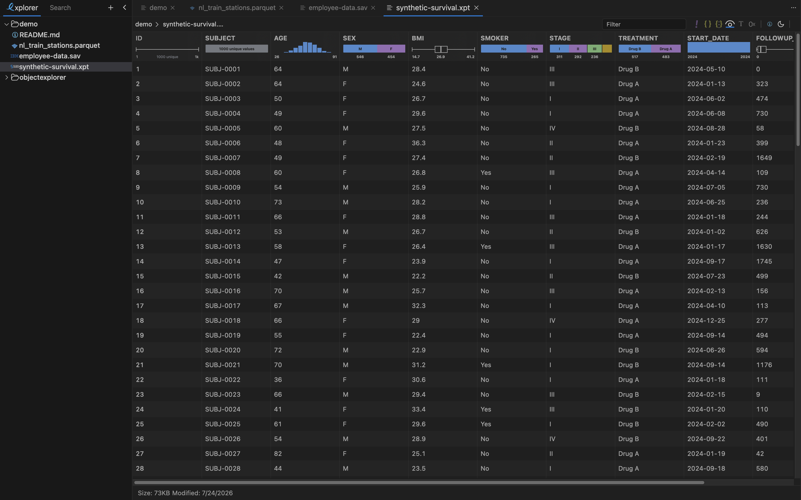

# ObjectExplorer

**The VSCode for Cloud Storage.** Browse, preview and search S3, Google Cloud Storage, Azure Blob
and local folders in one window — and every byte stays on your machine.



## Install

Every link below always points at the newest build. Click the one for your machine.

| Platform | Download |
|---|---|
| macOS, Apple Silicon | [ObjectExplorer-mac-arm64.dmg](https://github.com/knockdata/objectexplorer/releases/latest/download/ObjectExplorer-mac-arm64.dmg) |
| macOS, Intel | [ObjectExplorer-mac-x64.dmg](https://github.com/knockdata/objectexplorer/releases/latest/download/ObjectExplorer-mac-x64.dmg) |
| Windows, x64 | [ObjectExplorer-windows-x64.msix](https://github.com/knockdata/objectexplorer/releases/latest/download/ObjectExplorer-windows-x64.msix) 
| Windows, ARM | [ObjectExplorer-windows-arm64.msix](https://github.com/knockdata/objectexplorer/releases/latest/download/ObjectExplorer-windows-arm64.msix) |
| Linux, x64 | [ObjectExplorer-linux-x64.AppImage](https://github.com/knockdata/objectexplorer/releases/latest/download/ObjectExplorer-linux-x64.AppImage) |
| Linux, ARM | [ObjectExplorer-linux-arm64.AppImage](https://github.com/knockdata/objectexplorer/releases/latest/download/ObjectExplorer-linux-arm64.AppImage) |

Older versions, and the release notes for each one, are on the
[releases page](https://github.com/knockdata/objectexplorer/releases).

**macOS** — open the `.dmg` and drag ObjectExplorer to Applications. The app is signed with a
Developer ID and notarized, so it opens on the first double-click.

**Windows** — It is signed with company's certificate. While you might see Smart Screen when you open the app.

Double-click it and Windows does the rest — a Start menu
  entry, an icon, and an entry in Add or remove programs that uninstalls cleanly. Choose this
  one if you would rather not keep track of where a binary lives.

ObjectExplorer will also be published later on the
[Microsoft Store](https://apps.microsoft.com/detail/9PMCD8HJPCXH).

**Linux** — one AppImage:

```sh
chmod +x ObjectExplorer-linux-x64.AppImage
./ObjectExplorer-linux-x64.AppImage
```

The window is drawn with the WebKitGTK your distribution ships, and ObjectExplorer opens in your
default browser on a machine that has none. To get the native window, install it:

```sh
sudo apt install libwebkit2gtk-4.1-0        # Debian, Ubuntu
sudo dnf install webkit2gtk4.1              # Fedora, RHEL
sudo pacman -S webkit2gtk-4.1               # Arch
sudo zypper install libwebkit2gtk-4_1-0     # openSUSE
```

On an older release without a 4.1 package, the 4.0 one (`libwebkit2gtk-4.0-37`, `webkit2gtk3`)
works too.

## Or run it with npx

No install at all, if you already have Node 20+ installed on your machine:

```sh
npx @knockdata/objectexplorer
```

It starts a local server, opens a browser tab, and shows the folder you ran it from. Both
arguments are optional:

```sh
npx @knockdata/objectexplorer ~/data port=9421
```

<details>
If you meet an error when running on windows.
<summary>Windows: "npx.ps1 cannot be loaded because running scripts is disabled on this system"</summary>

- Right click PowerShell and choose **Run as administrator**
- Run `Get-ExecutionPolicy` — if it says `Restricted`, it needs changing
- Run `Set-ExecutionPolicy RemoteSigned`
- Run `Get-ExecutionPolicy` again — it should now say `RemoteSigned`

`npx` then works in that terminal, and in any new one.

</details>

## What it solves

A cloud console can list your objects and little else. To find out what is actually inside a
Parquet file you download it, open a notebook, read it, and delete the copy — for one look at one
file. Do that across three providers and you are also juggling three consoles, three sets of
credentials, and a `Downloads` folder full of data that should never have left the bucket.

ObjectExplorer collapses that loop:

- **One window for every provider.** S3, GCS, Azure Blob and your local disks in the same tree, with
  the same keyboard shortcuts.
- **Preview instead of download.** Formats render in place — including the ones no console will ever
  open, like Parquet, SPSS and SAS.
- **Search across buckets.** One query over local folders and cloud prefixes at the same time.

## Your data never leaves your machine

This is the part that matters when you work with data you are not allowed to copy.

ObjectExplorer is an HTTP server bound to `127.0.0.1` plus the OS webview, both inside the same
executable. Every parser — Parquet, SPSS, SAS, PDF, the office formats, the image decoders — runs
in a worker on your own machine.

- Objects are fetched **from your cloud provider to your computer**, and nowhere else. We run no
  backend that sees your data, because there is nothing for it to see.
- Credentials stay local: `~/.objectexplorer/folders.json`, plus whatever your platform CLI or
  keychain already holds. Nothing is synced.
- The only call that is not to your own storage is a version check against the npm registry, so the
  app can tell you an update exists.
- Nothing is uploaded for "processing", no file names are reported anywhere, and no account is
  needed to open a file.

Which also means there is no data-processing agreement to negotiate before anyone can look at a
bucket.

## Storage providers

| | Provider | Connect with |
|---|---|---|
|  | Amazon S3 | drop your `accessKeys.csv`, paste a key ID and secret, or sign in with the AWS CLI |
|  | Google Cloud Storage | sign in with your Google account |
|  | Azure Blob Storage | a connection string, a SAS URL, or sign in with Microsoft |
|  | MinIO | your own endpoint, for self-hosted S3-compatible storage |
|  | Local folders | the native folder picker — any disk, any mounted volume |

Buckets show up in the tree once you add them, so a thousand-bucket account still opens on the five
you actually use.

## Features

### Column summary


Open a table and every column comes with its own shape: a histogram for numbers, a box plot for
distributions, a split bar for categories, a unique count for identifiers, the range underneath. It
answers "is this the file I want?" without a line of pandas — computed locally, straight from the
file you are looking at.

Works on Parquet, CSV, SPSS `.sav` and SAS `.xpt`.

### Search

Search local folders and cloud buckets in the same run: literal, whole word or regex, with include
and exclude globs, and `.gitignore` honoured when you point it at a repo. Results group by file with
the matching line in context, and large objects are searched without pulling them down whole.

### Hex

Any file, any size, straight to bytes. Offsets, hex pairs and the ASCII column, virtualized so a
multi-gigabyte object opens instantly instead of after a spinner. Exactly what you need when a
format is not recognized and the first 64 bytes decide what it is.

### Sprite sheets


Open a TextureAtlas or SpriteSheet XML and ObjectExplorer draws it: the atlas image with every
sprite's bounding box overlaid and named, aligned to the real pixels however the image is scaled.
Hover a box to read the frame name — no importing the sheet into an engine to find out which tile is
`medievalTile_04`.

### Inside archives, without extracting

Step into a `.zip`, a `.dmg`, or an office file — `.pptx` and `.xlsx` are zips too — and browse the
entries as if they were folders. Each entry previews with its own viewer, so a CSV inside a zip
inside a bucket is still just a table.

## Formats

| | Kind | Formats |
|---|---|---|
|  | Parquet | `parquet` — schema, rows, column summaries |
|  | Tabular | `csv` `json` `jsonl` `yaml` `yml` |
|  | Statistics | `xpt` (SAS transport), `sav` (SPSS) |
|  | Presentations | `pptx` `potx` `ppsx` `ppt` `pot` `pps` `key` |
|  | Spreadsheets | `xlsx` `xltx` |
|  | Documents | `docx` `dotx` `pdf` `evernote` |
|  | Text and code | `md` `markdown` `txt` `html` `xml` `xsl` `js` `py`, syntax highlighted |
|  | Notebooks | `ipynb` — cells with their outputs |
|  | Images | `png` `jpg` `jpeg` `webp` `svg` `ico` — with EXIF, GPS and embedded text |
|  | Audio | `mp3` `wav` `m4a` `aiff` `bwf` `3gpp` — waveform and spectrogram |
|  | Video | played in place, no download first |
|  | Drawings | `excalidraw` |
|  | Diagrams | `mmd` `mermaid`, rendered |
|  | Archives | `zip` `dmg` `apkg`, and the office formats, browsed as folders |
|  | Apple | `plist` `provisionprofile` `.DS_Store` — binary plists decoded |
|  | Everything else | hex, always available |

## Links

- [objectexplorer.com](https://objectexplorer.com) — screenshots and the full tour
- [@knockdata/objectexplorer](https://www.npmjs.com/package/@knockdata/objectexplorer) — the npm package behind `npx`
- [Releases](https://github.com/knockdata/objectexplorer/releases) — every version, every platform

Under the hood it is a single native binary: no Electron, no Chromium, just the OS webview (WebKit
on macOS and Linux, WebView2 on Windows) pointed at the HTTP server running inside the same
executable.
