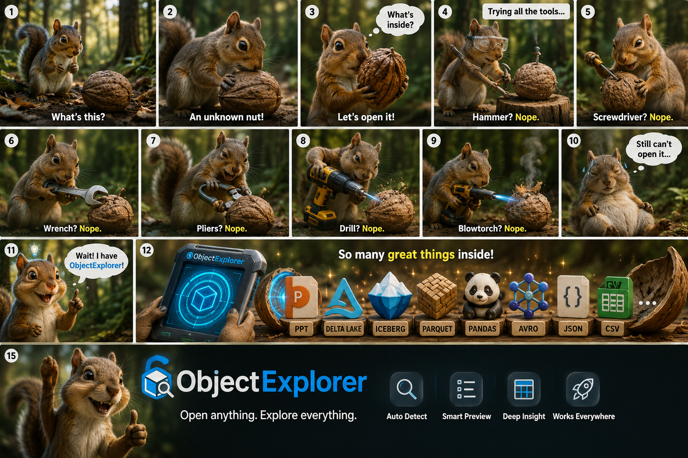
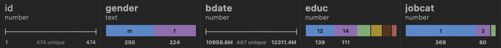
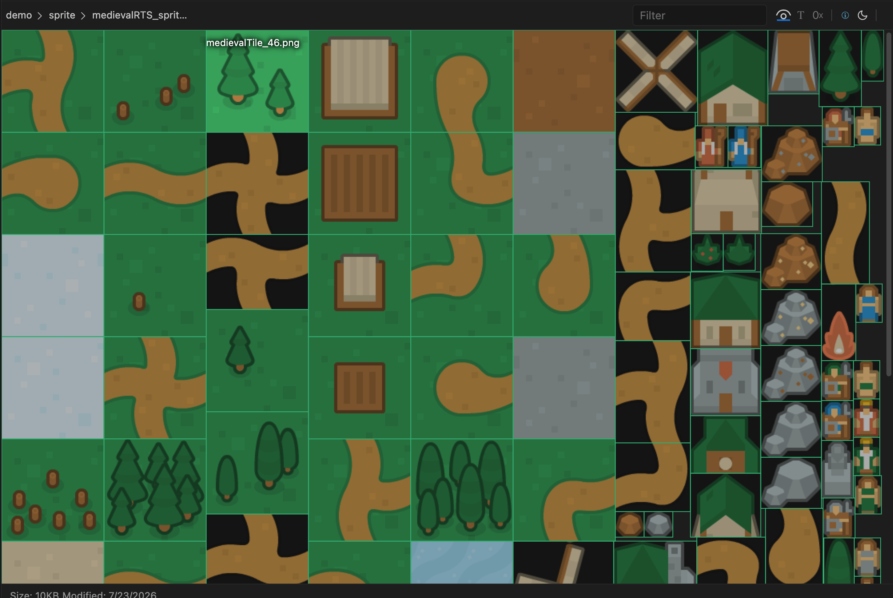
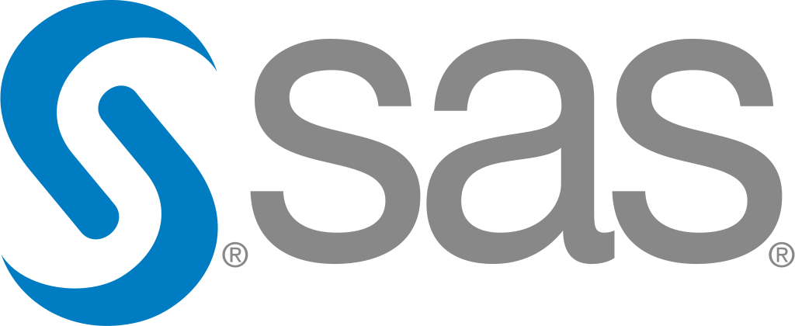
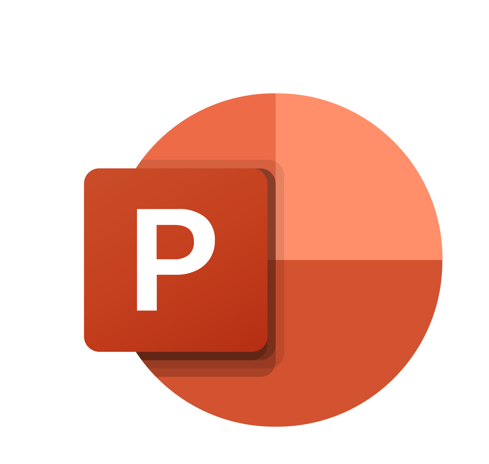
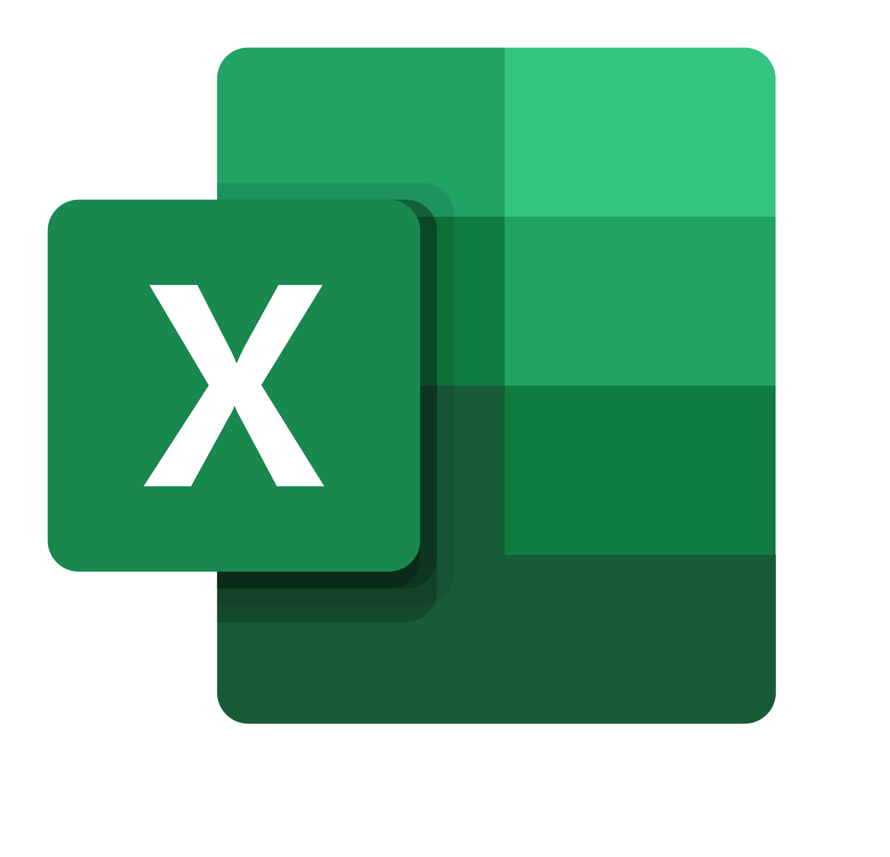
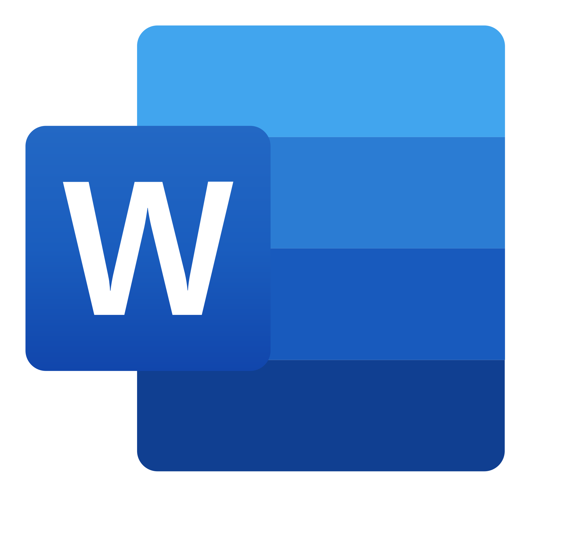

# ObjectExplorer

**The VSCode for Cloud Storage.** Browse, preview, query and search S3, Google Cloud Storage,
Azure Blob and local folders in one window — and every byte stays on your machine.



## Install

Access instantly [https://objectexplorer.com/app](https://objectexplorer.com/app) 

Or download the latest version. Click the one for your machine.

| Platform | Download |
|---|---|
| macOS, Apple Silicon | [ObjectExplorer-mac-arm64.dmg](https://github.com/knockdata/objectexplorer/releases/latest/download/ObjectExplorer-mac-arm64.dmg) |
| macOS, Intel | [ObjectExplorer-mac-x64.dmg](https://github.com/knockdata/objectexplorer/releases/latest/download/ObjectExplorer-mac-x64.dmg) |
| Windows, x64 | [ObjectExplorer-windows-x64.msix](https://github.com/knockdata/objectexplorer/releases/latest/download/ObjectExplorer-windows-x64.msix) 
| Windows, ARM | [ObjectExplorer-windows-arm64.msix](https://github.com/knockdata/objectexplorer/releases/latest/download/ObjectExplorer-windows-arm64.msix) |
| Linux, x64 | [ObjectExplorer-linux-x64.AppImage](https://github.com/knockdata/objectexplorer/releases/latest/download/ObjectExplorer-linux-x64.AppImage) |
| Linux, ARM | [ObjectExplorer-linux-arm64.AppImage](https://github.com/knockdata/objectexplorer/releases/latest/download/ObjectExplorer-linux-arm64.AppImage) |

Older versions, and the release notes for each one, are on the
[releases page](https://github.com/knockdata/objectexplorer/releases).

**macOS** — open the `.dmg` and drag ObjectExplorer to Applications. The app is signed with a
Developer ID and notarized, so it opens on the first double-click.

**Windows** — It is signed with company's certificate. While you might see Smart Screen when you open the app.

Double-click it and Windows does the rest — a Start menu
  entry, an icon, and an entry in Add or remove programs that uninstalls cleanly. Choose this
  one if you would rather not keep track of where a binary lives.

ObjectExplorer will also be published later on the
[Microsoft Store](https://apps.microsoft.com/detail/9PMCD8HJPCXH).

**Linux** — one AppImage:

```sh
chmod +x ObjectExplorer-linux-x64.AppImage
./ObjectExplorer-linux-x64.AppImage
```

The window is drawn with the WebKitGTK your distribution ships, and ObjectExplorer opens in your
default browser on a machine that has none. To get the native window, install it:

```sh
sudo apt install libwebkit2gtk-4.1-0        # Debian, Ubuntu
sudo dnf install webkit2gtk4.1              # Fedora, RHEL
sudo pacman -S webkit2gtk-4.1               # Arch
sudo zypper install libwebkit2gtk-4_1-0     # openSUSE
```

On an older release without a 4.1 package, the 4.0 one (`libwebkit2gtk-4.0-37`, `webkit2gtk3`)
works too.

## Or run it with npx

No install at all, if you already have Node 20+ installed on your machine:

```sh
npx @knockdata/objectexplorer
```

It starts a local server, opens a browser tab, and shows the folder you ran it from. Both
arguments are optional:

```sh
npx @knockdata/objectexplorer ~/data port=9421
```

<details>
If you meet an error when running on windows.
<summary>Windows: "npx.ps1 cannot be loaded because running scripts is disabled on this system"</summary>

- Right click PowerShell and choose **Run as administrator**
- Run `Get-ExecutionPolicy` — if it says `Restricted`, it needs changing
- Run `Set-ExecutionPolicy RemoteSigned`
- Run `Get-ExecutionPolicy` again — it should now say `RemoteSigned`

`npx` then works in that terminal, and in any new one.

</details>

## What it solves

A cloud console can list your objects and little else. To find out what is actually inside a
Parquet file you download it, open a notebook, read it, and delete the copy — for one look at one
file. Do that across three providers and you are also juggling three consoles, three sets of
credentials, and a `Downloads` folder full of data that should never have left the bucket.

ObjectExplorer collapses that loop:

- **One window for every provider.** S3, GCS, Azure Blob and your local disks in the same tree, with
  the same keyboard shortcuts.
- **Preview instead of download.** Formats render in place — including the ones no console will ever
  open, like Parquet, SPSS and SAS.
- **Search across buckets.** One query over local folders and cloud prefixes at the same time.
- **Query, chart and model in place.** A table opens as a notebook: SQL over the object, a chart of
  what came back, and a gradient boosting model over the rows — all on your machine.
- **Delta, Iceberg and Hudi are just tables.** Point DuckDB at the folder and it answers, deletes
  and schema changes included.
- **Move things where they belong.** Copy, move, rename and delete across buckets and disks, with
  one Undo — the explorer half of a file explorer, not only the reading half.

## Your data never leaves your machine

This is the part that matters when you work with data you are not allowed to copy.

ObjectExplorer is an HTTP server bound to `127.0.0.1` plus the OS webview, both inside the same
executable. Every parser — Parquet, SPSS, SAS, PDF, the office formats, the image decoders — runs
in a worker on your own machine.

- Objects are fetched **from your cloud provider to your computer**, and nowhere else. We run no
  backend that sees your data, because there is nothing for it to see.
- Credentials stay local: `~/.objectexplorer/folders.json`, plus whatever your platform CLI or
  keychain already holds. Nothing is synced.
- The only call that is not to your own storage is a version check against the npm registry, so the
  app can tell you an update exists.
- Nothing is uploaded for "processing", no file names are reported anywhere, and no account is
  needed to open a file.

Which also means there is no data-processing agreement to negotiate before anyone can look at a
bucket.

## Storage providers

| | Provider | Connect with |
|---|---|---|
|  | Amazon S3 | drop your `accessKeys.csv`, paste a key ID and secret, or sign in with the AWS CLI |
|  | Google Cloud Storage | sign in with your Google account |
|  | Azure Blob Storage | a connection string, a SAS URL, or sign in with Microsoft |
|  | MinIO | your own endpoint, for self-hosted S3-compatible storage |
|  | Local folders | the native folder picker — any disk, any mounted volume |

Buckets show up in the tree once you add them, so a thousand-bucket account still opens on the five
you actually use.

## Features

### Column summary



Open a table and every column comes with its own shape: a histogram for numbers, a box plot for
distributions, a split bar for categories, a unique count for identifiers, the range underneath. It
answers "is this the file I want?" without a line of pandas — computed locally, straight from the
file you are looking at.

Works on Parquet, CSV, SPSS `.sav` and SAS `.xpt`.

### Notebook

Open a table and it opens as a notebook: a column of cells, each one a few lines of code over its
own output. The first two are already written — a `SELECT *` over the object you clicked, and a
chart of what that query returned — so the file is queried and plotted before you have typed
anything.

```sql
SELECT * FROM 'gs://sales-eu/orders/2026-08-24.parquet' LIMIT 10000
```

The query runs on your machine, against the object where it lives. Nothing is staged into a
temporary folder first: DuckDB reads the bucket directly, so a `WHERE` over a multi-gigabyte
Parquet file touches the row groups it needs and no more.

Cells are piped rather than shared. Each one reads the rows produced by the nearest cell above it
that produced any, so a query narrows the data and everything under it — the chart, the model, the
next query — sees what came back. Nothing re-runs on its own: a cell runs from its run button or
Shift+Enter, so what is on screen is always something you asked for.

| Cell | What it is |
|---|---|
| **Table** | SQL, with the rows as a virtualized grid — column summaries and all |
| **Chart** | a plot of the rows above, as source you can edit |
| **Model** | gradient boosting over the rows above |
| **Code** | JavaScript over the same rows, with [pandasjs](https://www.npmjs.com/package/@rockiey/pandasjs) — `pd` — already in scope |
| **Text** | markdown, rendered when you click away |

A chart cell writes its own first draft. The column statistics say which column is a date, which is
a category, which is a measure and which is an id that counts up once per row — and the strip under
the code offers the charts those columns actually support, named in plain words. Click one and its
source is written into the editor and drawn. After that it is source, and it is yours.

A folder is a table too: Delta, Iceberg and Hudi tables, Hive-partitioned exports and `YYYY/MM/DD`
date prefixes are read as one table rather than as a pile of files — see
[Data lake tables](#data-lake-tables).

Notebooks are kept per object. Reopen the file next week — in another window, or after a restart —
and your cells are still there.

Queryable: `parquet` `csv` `tsv` `json` `jsonl` `xlsx` `avro`, plus SPSS `.sav` and SAS
`.sas7bdat` `.xpt`. ORC, Arrow and HDF5 open as grids and charts too; only SQL over them is
missing, and the cell says so.

### Data lake tables

A Delta, Iceberg or Hudi table is a folder, and the folder itself says which of the parquet files
inside it the table is currently made of. So the path is the whole SQL surface — name the folder
and it answers:

```sql
SELECT region, sum(amount) FROM 's3://sales-eu/orders' GROUP BY region
```

There is no `delta_scan()` or `iceberg_scan()` to remember. A quoted path straight after `FROM` or
`JOIN` is sniffed — a `_delta_log` beside the files, a `metadata/` of metadata.json, a `.hoodie` —
and rewritten into the query that really reads it before DuckDB sees a character of it.

That query is the table as of now, not a list of every parquet in the folder:

| | What it takes to be right |
|---|---|
| **Delta** | partition columns live in the log rather than in the parquet, column mapping names the physical columns by uuid, and a deletion vector marks rows inside a file that is otherwise live |
| **Iceberg** | schema evolution is resolved by field id, so a renamed column still reads and an added one reads as its default; position deletes, equality deletes and deletion vectors each become their own anti-join |
| **Hudi** | a merge-on-read slice stacks its base file under the log files written over it, and the last write of each record key wins |

A table with none of that — the common one — comes out as a single scan over a file list, which is
all it should ever have been.

**The metadata is readable too**, as the thing it actually is rather than as a folder of opaque
files. `_delta_log` opens as the commit history, every version with the files it added and removed
underneath it. `.hoodie` opens as the timeline, including the requested and inflight instants a
writer that died left behind. An Iceberg `metadata/` opens as the chain it really is —
metadata.json, snapshot, manifest list, manifest, and the data and delete files at the end of it.

Hive-partitioned exports and `YYYY/MM/DD` date prefixes read as one table the same way.

### Train a model on it

A model cell is gradient boosting — LightGBM, compiled to WebAssembly and running inside the app —
over the rows the cell above produced.

Pick the label, the column you want predicted, and the rest comes from the same statistics the grid
already drew: whether the question is *which one* or *how much*, which columns are worth training
on, and which are row numbers, ids or coordinates that would teach the model the order the file was
written in and nothing else.

The controls hide nothing. Leaves, learning rate and iterations are three sliders, and moving one
prints the JavaScript underneath it — that printed source is what trains, so a slider and a hand
edit end in the same place.

Two plots come out of it. Training draws what the model learned: the features ranked by their share
of the total gain. Prediction answers the other question — pick a row, and a waterfall walks from
what the model says on average to what it said about that one row, feature by feature. Those
contributions are TreeSHAP, exact and additive, so the steps add up to the prediction rather than
approximating it. Both plots show the same features in the same order, so the pair reads across:
what a column is worth over the whole file, and what it did to this row.

It all runs where the data already is. A model over a bucket you are not allowed to copy out of is
still just a local read.

### Copy, move, rename, delete

The other half of a file explorer. `⌘C` `⌘X` `⌘V`, `F2` to rename, `⌫` to delete, and drag between
any two places in the tree — within a root it moves, across roots it copies, and `⌥` or `⌘` says so
explicitly.

It works across providers, and that is the part a console cannot do: a prefix dragged from S3 to
Azure streams through your machine and lands as objects, and the destination's size is read back
before a move deletes anything. Within one provider the bytes never touch your machine at all — GCS
`rewriteTo`, S3 `x-amz-copy-source`, Azure `x-ms-copy-source`, a plain `cp` on disk. A transfer
reports its progress in the footer, so an hour-long copy is not an hour-long wait on a spinner.

Nothing is ever unlinked. A delete moves the object into a `.trash` folder at the top of its own
root — the same layout in a bucket and in a local folder — so `⌘Z` is a move back rather than a
hope, and it puts back whatever an overwrite wrote over too. The trash is emptied after 30 days.

### Search

Search local folders and cloud buckets in the same run: literal, whole word or regex, with include
and exclude globs, and `.gitignore` honoured when you point it at a repo. Results group by file with
the matching line in context, and large objects are searched without pulling them down whole.

### Hex

Any file, any size, straight to bytes. Offsets, hex pairs and the ASCII column, virtualized so a
multi-gigabyte object opens instantly instead of after a spinner. Exactly what you need when a
format is not recognized and the first 64 bytes decide what it is.

### Sprite sheets



Open a TextureAtlas or SpriteSheet XML and ObjectExplorer draws it: the atlas image with every
sprite's bounding box overlaid and named, aligned to the real pixels however the image is scaled.
Hover a box to read the frame name — no importing the sheet into an engine to find out which tile is
`medievalTile_04`.

### Ebook reader

Open an `.epub`, `.mobi`, `.azw3`, `.fb2` or a `.cbz` comic and it opens as a book: a cover, a page
that is one screenful, and the side arrows or the arrow keys to turn it. The text reflows to the
window, so a chapter reads the same whether the file came from a bucket or from a zip on your disk —
no Kindle, no Calibre, no converting it first.

### Cloud Logging

A Google Cloud project can be switched live, and ObjectExplorer tails Cloud Logging into a local
store: the tail belongs to the app, not to the window, so it keeps collecting while you are
elsewhere and is still there after a restart. The tree under the project is the one the logs
describe — resource type, resource, then the single service.

Log files that a sink already exported to a bucket open the same way. Point at one NDJSON object, or
at the whole `YYYY/MM/DD` prefix, and the viewer walks it newest first. Cloud Logging entries and
OpenTelemetry records both read as the same rows.

The viewer itself:

- **A timeline you can grab** — one bar per slot, grey for ordinary lines, orange for warnings, red
  for errors, so a burst of errors is a red block. Drag to pick a range, click a bar for that slot,
  zoom and step window by window.
- **Two trees over the same lines** — *source* answers "which service wrote this", *trace* answers
  "what happened during this request", drawn as a waterfall of spans by duration.
- **Filter as you read** — severity chips and text search narrow the rows, never the shape of the
  timeline you are aiming at.

### Inside archives, without extracting

Step into a `.zip`, a `.dmg`, or an office file — `.pptx` and `.xlsx` are zips too — and browse the
entries as if they were folders. Each entry previews with its own viewer, so a CSV inside a zip
inside a bucket is still just a table.

## Formats

| | Kind | Formats |
|---|---|---|
|  | Parquet | `parquet` — schema, rows, column summaries |
|  | Data lake | `delta` `iceberg` `hudi`, Hive and date partitions — a folder read as one table |
|  | Tabular | `csv` `json` `jsonl` `yaml` `yml` |
|  | Statistics | `xpt` (SAS transport), `sav` (SPSS) |
|  | Presentations | `pptx` `potx` `ppsx` `ppt` `pot` `pps` `key` |
|  | Spreadsheets | `xlsx` `xltx` |
|  | Documents | `docx` `dotx` `pdf` `evernote` |
|  | Ebooks | `epub` `mobi` `prc` `azw` `azw3` `fb2` `fbz` `cbz` `cbt` — read as a book |
|  | Logs | Cloud Logging and OpenTelemetry, live or exported |
|  | Text and code | `md` `markdown` `txt` `html` `xml` `xsl` `js` `py`, syntax highlighted |
|  | Notebooks | `ipynb` — cells with their outputs |
|  | Images | `png` `jpg` `jpeg` `webp` `svg` `ico` — with EXIF, GPS and embedded text |
|  | Audio | `mp3` `wav` `m4a` `aiff` `bwf` `3gpp` — waveform and spectrogram |
|  | Video | played in place, no download first |
|  | Drawings | `excalidraw` |
|  | Diagrams | `mmd` `mermaid`, rendered |
|  | Archives | `zip` `dmg` `apkg`, and the office formats, browsed as folders |
|  | Apple | `plist` `provisionprofile` `.DS_Store` — binary plists decoded |
|  | Everything else | hex, always available |

## Links

- [objectexplorer.com](https://objectexplorer.com) — screenshots and the full tour
- [@knockdata/objectexplorer](https://www.npmjs.com/package/@knockdata/objectexplorer) — the npm package behind `npx`
- [Changelog](https://github.com/knockdata/objectexplorer/blob/main/CHANGELOG.md) — what changed in each version
- [Releases](https://github.com/knockdata/objectexplorer/releases) — every version, every platform

Under the hood it is a single native binary: no Electron, no Chromium, just the OS webview (WebKit
on macOS and Linux, WebView2 on Windows) pointed at the HTTP server running inside the same
executable.
